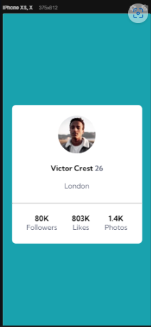

# Exercício HTML + CSS Avançado - Profile Card

**Descrição da tarefa**: Esse exercício é uma **ALTERNATIVA** ao desafio do frontend mentor. Onde o principal desafio é criar um cartão que contenha as informações de perfil. Para ser aprimorado as habilidades de posicionamento de elementos usando flexbox.

Layout esperado para desktop:


Layout esperado para mobile:


## Tecnologias utilizadas
- HTML
- CSS

## Como utilizar?

1- Clone o projeto selecione a pasta aonde quer que ele fique
```
git clone url do projeto
```
2- Acesse a pasta do projeto e abra com o code (VSCode)

[]